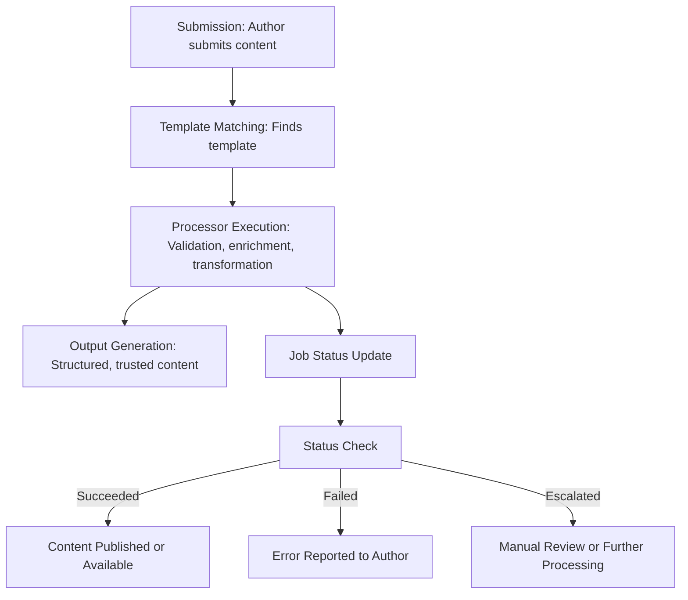

# Semantic Publishing Protocol (SPP)

Welcome to the Semantic Publishing Protocol! This project is building the next generation of open, user-centric publishing for the web and AI.

---

## Why This Changes Everything

The Semantic Publishing Protocol lets AI agents participate in the web like humans do—natively, semantically, and in real time. For the first time, intelligent systems can publish, subscribe, and act on content as first-class citizens, not just as background scrapers or guessers.

With SPP, every document becomes a structured event that other systems—human or machine—can subscribe to, process, and build on. This turns the web into a living, interconnected network of knowledge, not just a static archive.

No more guesswork: SPP enables intent-driven, context-aware publishing. AI pipelines can finally work with content that’s designed for them, unlocking new levels of automation, collaboration, and trust.

This is the foundation for a future where humans and AI co-create, discover, and act—together, in real time.

---

## 1. What is the Semantic Publishing Protocol?

The Semantic Publishing Protocol (SPP) is an open standard for publishing, sharing, and remixing content in a way that is machine-readable, user-controlled, and future-proof. It lets anyone publish structured content that can be discovered, reused, and trusted by both people and intelligent agents.

---

## 2. Why does this matter?

Today’s web is full of locked-down content, privacy issues, and platforms that don’t put users first. SPP solves this by:
- Giving users control over their data and consent
- Making content easy to remix, verify, and attribute
- Enabling fair monetisation and transparent trust
- Powering AI and next-gen browsers with rich, structured data

---

## 3. Core Concepts

- **Job:** A publishing or processing task (e.g., publish an article, verify a claim)
- **Template:** A reusable structure for content (e.g., article, recipe, review)
- **Processor:** A tool or agent that reads, validates, or transforms content
- **Submission:** The act of publishing or updating content in the protocol
- **Output:** The result—structured, trusted, and reusable content

---

# Semantic Publishing Protocol – System Flow Diagram

Below is a simple block-style diagram showing the end-to-end flow of a document through the Semantic Publishing Protocol.

This diagram illustrates the main steps and decision points in the SPP document lifecycle.

---

## Who Should Use This?

The Semantic Publishing Protocol is designed for anyone building or managing modern, intelligent document workflows:

- **Solution Architects:** Designing scalable, interoperable publishing or data-sharing systems
- **Developers:** Creating apps, integrations, or automation for document processing, validation, or publishing
- **ML & AI Engineers:** Building intelligent agents, document classifiers, or content enrichment pipelines
- **Platform Builders:** Enabling user-driven publishing, attribution, and consent in new or existing products
- **Researchers & Standards Contributors:** Exploring the future of open, trusted, and machine-readable content

SPP is built for extensibility. It works seamlessly with AI-powered document processors, automated validation tools, and human-in-the-loop review systems. Whether you’re building for the open web, enterprise, or next-gen AI, SPP provides a flexible foundation for trusted, user-centric publishing.

---

## 4. How it Works

1. **Create**: Authors use templates to structure their content (like filling out a smart form).
2. **Submit**: The content is published to a registry or shared directly with others.
3. **Process**: Agents and tools validate, enrich, and connect the content.
4. **Discover & Remix**: Anyone (or any AI) can find, verify, and reuse the content—always with clear attribution and consent.

---

## 5. What’s in this repo?

## What’s in this Repo?

- **/specs** – Core protocol specifications, data models, and compliance rules. Start here for technical details and implementation guidance.
- **/schemas** – Machine-readable JSON or YAML schemas for validating SPP documents and templates. Useful for developers and integrators.
- **/examples** – Sample submissions, templates, and protocol flows. Great for learning by example or testing your own tools.
- **/docs** – Guides, onboarding materials, changelogs, and the glossary. Start here if you’re new or want conceptual overviews.
- **/test-vectors** – (If present) Reference inputs and expected outputs for protocol conformance and automated testing.

Technical users should start with `/specs` and `/schemas`. Non-technical users or newcomers can begin with `/docs` and the examples.

---

## 6. Who is this for?

- **Publishers & Authors:** Want to reach new audiences and keep control
- **Developers & Toolmakers:** Building apps, agents, or platforms on open data
- **Researchers & Standards Folks:** Interested in the future of web publishing
- **Anyone:** Who cares about privacy, trust, and the open web

---

## 7. Where to go next?

- [QUICKSTART](./docs/QUICKSTART.md): Get hands-on in minutes
- [Full Specification](./docs/spec-index.md): Dive into the protocol details

---

We’re excited to have you here. Explore, experiment, and help shape the future of publishing!

