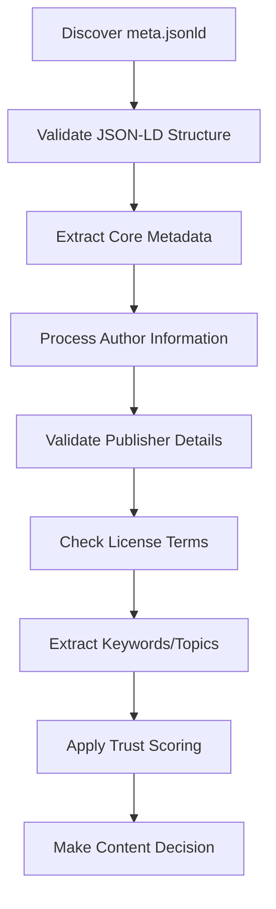
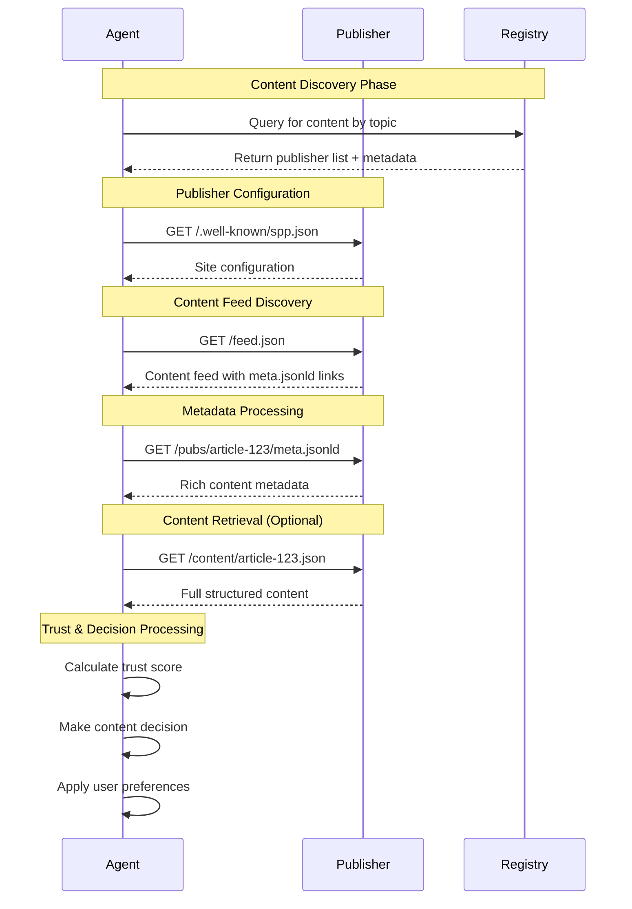
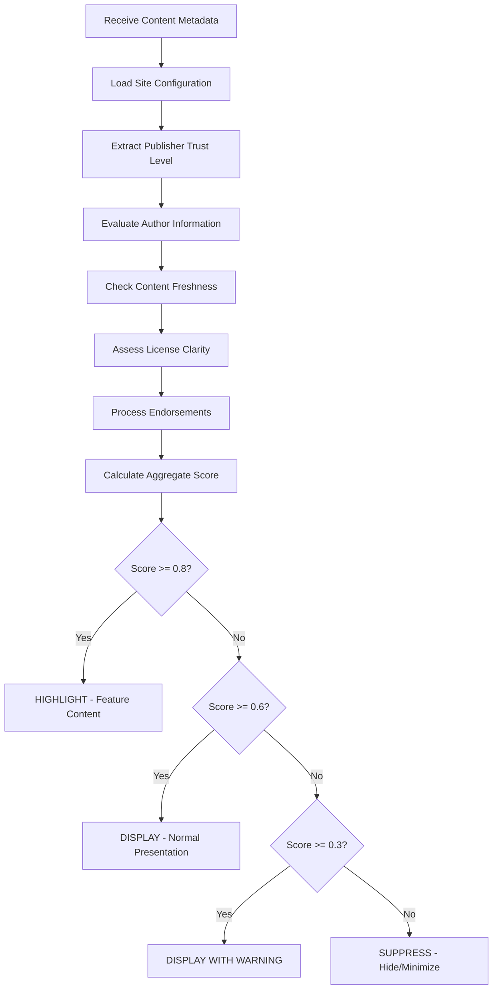

# AI Agent Usage Guide

A comprehensive guide for AI agents to parse, understand, and interact with Semantic Publishing Protocol (SPP) content.

---

## 🤖 Overview

AI agents in the SPP ecosystem are **first-class citizens** designed to intelligently consume, process, and act upon structured semantic content. This guide explains how agents can:

- Parse `meta.jsonld` files to extract rich content metadata
- Use `site.config.json` for publisher context and configuration
- Request and consume content through standardized protocols
- Implement trust-based content decisions

---

## 📋 Table of Contents

1. [Agent Architecture](#agent-architecture)
2. [Parsing meta.jsonld](#parsing-metajsonld)
3. [Understanding site.config.json](#understanding-siteconfigjson)
4. [Content Request Patterns](#content-request-patterns)
5. [Practical Examples](#practical-examples)
6. [Integration Examples](#integration-examples)
7. [Trust and Verification](#trust-and-verification)
8. [Error Handling](#error-handling)

---

## 🏗️ Agent Architecture

### Agent Identity Declaration

Every SPP agent must declare its identity and capabilities:

```json
{
  "agent_id": "agent:content-curator.v2",
  "ssot_id": "ssot:news-agency",
  "type": "content-aggregator",
  "version": "2.1.0",
  "purpose": "Aggregate and curate news content for morning briefings",
  "permissions": ["read", "summarise", "explain", "rate", "request"],
  "protocolVersion": "1.0.0"
}
```

### Core Agent Actions

Agents can perform these primary actions:

- **`read()`** - Parse and consume semantic content
- **`summarise()`** - Generate concise summaries
- **`explain()`** - Provide accessible explanations
- **`rate()`** - Assign relevance/trust scores
- **`request()`** - Fetch content from publishers

---

## 📄 Parsing meta.jsonld

The `meta.jsonld` file contains rich metadata about individual publications. Here's how agents should process it:

### Basic Structure

```json
{
  "@context": "https://schema.org",
  "@type": "Article",
  "name": "Understanding AI Ethics in 2025",
  "datePublished": "2025-01-28T10:00:00Z",
  "protocolVersion": "1.0.0",
  "author": {
    "@type": "Person",
    "name": "Dr. Sarah Chen",
    "url": "https://example.com/authors/sarah-chen"
  },
  "publisher": {
    "@type": "Organization", 
    "name": "Tech Ethics Journal",
    "url": "https://techethics.example.com"
  },
  "description": "A comprehensive analysis of emerging AI ethics frameworks",
  "keywords": ["AI", "ethics", "technology", "governance"],
  "license": "CC-BY-4.0",
  "url": "https://techethics.example.com/articles/ai-ethics-2025"
}
```

### Agent Processing Flow



### Key Parsing Steps

1. **Validate Structure**: Ensure required fields (`@context`, `@type`, `name`, `datePublished`, `protocolVersion`)
2. **Extract Metadata**: Parse title, description, publication date, and author information
3. **Process Relationships**: Understand publisher context and author attribution
4. **Apply Context**: Use site configuration for additional context
5. **Score Content**: Apply trust algorithms based on available signals

---

## ⚙️ Understanding site.config.json  

The `site.config.json` provides publisher-level context that agents use to understand the source and apply appropriate processing rules.

### Structure Overview

```json
{
  "protocolVersion": "1.0.0",
  "siteMetadata": {
    "name": "Tech Ethics Journal",
    "url": "https://techethics.example.com",
    "description": "Leading publication on AI ethics and governance",
    "language": "en-US",
    "publisher": {
      "name": "Ethics Research Institute",
      "url": "https://ethicsresearch.org",
      "organizationType": "nonprofit"
    },
    "topics": ["AI", "ethics", "technology", "governance"],
    "license": "CC-BY-4.0"
  },
  "publishingSettings": {
    "defaultContentType": "article",
    "feedUrl": "https://techethics.example.com/feed.json",
    "sitemapUrl": "https://techethics.example.com/sitemap.json",
    "enableAnalytics": true
  },
  "trustSettings": {
    "verificationLevel": "verified",
    "allowEndorsements": true,
    "trustedSources": [
      "https://academic-source.edu",
      "https://peer-reviewed-journal.org"
    ]
  }
}
```

### Agent Usage of Site Config

```javascript
class SPPAgent {
  async processSite(siteConfigUrl) {
    const config = await this.fetchJson(siteConfigUrl);
    
    // Extract publisher trust indicators
    const trustLevel = this.calculatePublisherTrust(config.trustSettings);
    
    // Set content processing rules
    const processingRules = {
      trustMultiplier: trustLevel,
      allowedContentTypes: [config.publishingSettings.defaultContentType],
      verificationRequired: config.trustSettings.verificationLevel === 'premium'
    };
    
    // Store for content processing
    this.publisherContext.set(config.siteMetadata.url, {
      config,
      processingRules,
      lastUpdated: Date.now()
    });
    
    return processingRules;
  }
}
```

---

## 📡 Content Request Patterns

### Discovery Flow

Agents typically discover and request content through these patterns:



### Trust Calculation Flow

The trust scoring process follows this sequence:



### HTTP Request Examples

#### 1. Site Discovery

```bash
GET /.well-known/spp.json HTTP/1.1
Host: techethics.example.com
User-Agent: SPPAgent/2.1.0
Accept: application/json
```

#### 2. Content Feed Request

```bash
GET /feed.json HTTP/1.1
Host: techethics.example.com
User-Agent: SPPAgent/2.1.0  
Accept: application/json
SPP-Agent-ID: agent:content-curator.v2
```

#### 3. Metadata Request

```bash
GET /pubs/ai-ethics-2025/meta.jsonld HTTP/1.1
Host: techethics.example.com
User-Agent: SPPAgent/2.1.0
Accept: application/ld+json, application/json
```

---

## 💡 Practical Examples

### Example 1: News Aggregation Agent

```javascript
class NewsAggregatorAgent {
  constructor() {
    this.identity = {
      agent_id: "agent:news-aggregator.v1",
      type: "content-aggregator",
      permissions: ["read", "summarise", "rate"]
    };
  }

  async aggregateNews(topics = ['technology', 'AI']) {
    const articles = [];
    
    for (const topic of topics) {
      // Discover publishers for this topic
      const publishers = await this.discoverPublishers(topic);
      
      for (const publisher of publishers) {
        // Get site configuration
        const siteConfig = await this.fetchSiteConfig(publisher.url);
        
        // Check if topic is supported
        if (!siteConfig.siteMetadata.topics.some(t => 
          topics.includes(t.toLowerCase()))) {
          continue;
        }
        
        // Fetch recent articles
        const feed = await this.fetchFeed(publisher.feedUrl);
        
        for (const item of feed.items.slice(0, 5)) {
          const metadata = await this.fetchMetadata(item.metadataUrl);
          
          // Score and filter content
          const score = this.scoreContent(metadata, siteConfig);
          if (score > 0.6) {
            articles.push({
              metadata,
              score,
              publisherConfig: siteConfig
            });
          }
        }
      }
    }
    
    // Sort by score and return top articles
    return articles
      .sort((a, b) => b.score - a.score)
      .slice(0, 20);
  }
  
  scoreContent(metadata, siteConfig) {
    let score = 0.5; // Base score
    
    // Trust boost from publisher verification
    if (siteConfig.trustSettings.verificationLevel === 'verified') {
      score += 0.2;
    }
    
    // Recency boost
    const ageHours = (Date.now() - new Date(metadata.datePublished)) / (1000 * 60 * 60);
    if (ageHours < 24) score += 0.1;
    
    // Author reputation (simplified)
    if (metadata.author?.url) score += 0.1;
    
    // License openness
    if (metadata.license?.includes('CC-')) score += 0.05;
    
    return Math.min(score, 1.0);
  }
}
```

### Example 2: Content Analysis Agent

```javascript
class ContentAnalysisAgent {
  async analyzeContent(metadataUrl) {
    // Fetch and parse metadata
    const metadata = await this.fetchMetadata(metadataUrl);
    
    // Extract key information
    const analysis = {
      title: metadata.name,
      publishDate: new Date(metadata.datePublished),
      author: this.extractAuthor(metadata.author),
      publisher: this.extractPublisher(metadata.publisher),
      topics: this.extractTopics(metadata.keywords),
      trustScore: 0,
      recommendations: []
    };
    
    // Fetch site context
    const siteConfig = await this.fetchSiteConfig(metadata.publisher.url);
    
    // Calculate trust score
    analysis.trustScore = this.calculateTrustScore(metadata, siteConfig);
    
    // Generate recommendations
    if (analysis.trustScore > 0.8) {
      analysis.recommendations.push("Highly trusted source - safe to highlight");
    } else if (analysis.trustScore < 0.3) {
      analysis.recommendations.push("Low trust signals - verify before sharing");
    }
    
    return analysis;
  }
  
  calculateTrustScore(metadata, siteConfig) {
    let score = 0.5;
    
    // Publisher verification level
    switch (siteConfig.trustSettings.verificationLevel) {
      case 'premium': score += 0.3; break;
      case 'verified': score += 0.2; break;
      case 'basic': score += 0.1; break;
    }
    
    // Author information completeness
    if (metadata.author?.url) score += 0.1;
    if (metadata.author?.['@type'] === 'Person') score += 0.05;
    
    // Content freshness
    const daysSincePublished = (Date.now() - new Date(metadata.datePublished)) / (1000 * 60 * 60 * 24);
    if (daysSincePublished < 7) score += 0.1;
    
    // License clarity
    if (metadata.license) score += 0.05;
    
    return Math.min(score, 1.0);
  }
}
```

---

## 🔗 Integration Examples

### n8n Workflow Integration

Here's how to integrate SPP content processing into an n8n workflow:

#### 1. n8n HTTP Request Node Configuration

```json
{
  "name": "Fetch SPP Metadata",
  "type": "n8n-nodes-base.httpRequest",
  "parameters": {
    "url": "={{ $json.metadataUrl }}",
    "authentication": "none",
    "requestMethod": "GET",
    "sendHeaders": true,
    "headerParameters": {
      "parameters": [
        {
          "name": "Accept",
          "value": "application/ld+json, application/json"
        },
        {
          "name": "User-Agent", 
          "value": "n8n-SPP-Agent/1.0"
        }
      ]
    }
  }
}
```

#### 2. n8n JavaScript Code Node for Processing

```javascript
// n8n Code Node: Process SPP Metadata
const items = $input.all();
const processedItems = [];

for (const item of items) {
  const metadata = item.json;
  
  // Validate required SPP fields
  if (!metadata['@context'] || !metadata['@type'] || !metadata.protocolVersion) {
    processedItems.push({
      json: { error: 'Invalid SPP metadata structure', original: metadata }
    });
    continue;
  }
  
  // Extract and structure key information
  const processed = {
    id: metadata.url || metadata.name?.replace(/\s+/g, '-').toLowerCase(),
    title: metadata.name,
    description: metadata.description,
    publishedAt: metadata.datePublished,
    modifiedAt: metadata.dateModified,
    author: {
      name: metadata.author?.name,
      type: metadata.author?.['@type'],
      url: metadata.author?.url
    },
    publisher: {
      name: metadata.publisher?.name,
      type: metadata.publisher?.['@type'],
      url: metadata.publisher?.url
    },
    keywords: Array.isArray(metadata.keywords) ? metadata.keywords : [],
    license: metadata.license,
    language: metadata.inLanguage,
    protocolVersion: metadata.protocolVersion,
    trustScore: 0.5 // Default, to be calculated by subsequent nodes
  };
  
  // Calculate basic trust score
  let trustScore = 0.5;
  if (processed.author.url) trustScore += 0.1;
  if (processed.license) trustScore += 0.1;
  if (processed.publisher.type === 'Organization') trustScore += 0.1;
  
  processed.trustScore = Math.min(trustScore, 1.0);
  
  processedItems.push({ json: processed });
}

return processedItems;
```

#### 3. Complete n8n Workflow Example

```json
{
  "name": "SPP Content Monitoring",
  "nodes": [
    {
      "name": "Schedule Trigger",
      "type": "n8n-nodes-base.scheduleTrigger",
      "parameters": {
        "rule": {
          "interval": [{ "field": "hours", "value": 6 }]
        }
      }
    },
    {
      "name": "Fetch Site Config",
      "type": "n8n-nodes-base.httpRequest", 
      "parameters": {
        "url": "https://techethics.example.com/.well-known/spp.json",
        "requestMethod": "GET"
      }
    },
    {
      "name": "Fetch Content Feed",
      "type": "n8n-nodes-base.httpRequest",
      "parameters": {
        "url": "={{ $json.publishingSettings.feedUrl }}",
        "requestMethod": "GET"
      }
    },
    {
      "name": "Split Feed Items", 
      "type": "n8n-nodes-base.itemLists",
      "parameters": {
        "operation": "splitOutItems",
        "fieldToSplitOut": "items"
      }
    },
    {
      "name": "Fetch Metadata",
      "type": "n8n-nodes-base.httpRequest",
      "parameters": {
        "url": "={{ $json.metadataUrl }}",
        "requestMethod": "GET",
        "sendHeaders": true,
        "headerParameters": {
          "parameters": [
            { "name": "Accept", "value": "application/ld+json" }
          ]
        }
      }
    },
    {
      "name": "Process SPP Content",
      "type": "n8n-nodes-base.code",
      "parameters": {
        "jsCode": "// JavaScript code from above example"
      }
    },
    {
      "name": "Filter High Trust Content",
      "type": "n8n-nodes-base.if",
      "parameters": {
        "conditions": {
          "number": [
            {
              "value1": "={{ $json.trustScore }}",
              "operation": "larger",
              "value2": 0.7
            }
          ]
        }
      }
    },
    {
      "name": "Send to Slack",
      "type": "n8n-nodes-base.slack",
      "parameters": {
        "resource": "message",
        "operation": "post",
        "channel": "#content-alerts",
        "text": "🚨 High-trust content: {{ $json.title }}\nPublisher: {{ $json.publisher.name }}\nTrust Score: {{ $json.trustScore }}\nLink: {{ $json.url }}"
      }
    }
  ],
  "connections": {
    "Schedule Trigger": { "main": [["Fetch Site Config"]] },
    "Fetch Site Config": { "main": [["Fetch Content Feed"]] },
    "Fetch Content Feed": { "main": [["Split Feed Items"]] },
    "Split Feed Items": { "main": [["Fetch Metadata"]] },
    "Fetch Metadata": { "main": [["Process SPP Content"]] },
    "Process SPP Content": { "main": [["Filter High Trust Content"]] },
    "Filter High Trust Content": { "true": [["Send to Slack"]] }
  }
}
```

### Daemon-based Agent Implementation

Here's a simple daemon implementation for continuous SPP content monitoring:

```javascript
#!/usr/bin/env node
// spp-monitor-daemon.js

import fs from 'fs';
import path from 'path';
import { EventEmitter } from 'events';

class SPPMonitorDaemon extends EventEmitter {
  constructor(config) {
    super();
    this.config = config;
    this.publishers = new Map();
    this.isRunning = false;
    this.intervals = new Map();
  }

  async start() {
    console.log('🤖 Starting SPP Monitor Daemon...');
    this.isRunning = true;
    
    // Load publisher configurations
    await this.loadPublishers();
    
    // Start monitoring loops
    this.startMonitoring();
    
    console.log(`✅ Daemon started, monitoring ${this.publishers.size} publishers`);
  }

  async loadPublishers() {
    for (const publisher of this.config.publishers) {
      try {
        const siteConfig = await this.fetchJson(publisher.configUrl);
        this.publishers.set(publisher.id, {
          ...publisher,
          config: siteConfig,
          lastCheck: 0,
          articles: new Map()
        });
        console.log(`📡 Loaded config for ${publisher.name}`);
      } catch (error) {
        console.warn(`⚠️  Failed to load ${publisher.name}: ${error.message}`);
      }
    }
  }

  startMonitoring() {
    for (const [publisherId, publisher] of this.publishers) {
      const interval = setInterval(async () => {
        await this.checkPublisher(publisherId);
      }, publisher.checkInterval || 300000); // Default 5 minutes
      
      this.intervals.set(publisherId, interval);
    }
  }

  async checkPublisher(publisherId) {
    const publisher = this.publishers.get(publisherId);
    if (!publisher) return;

    try {
      console.log(`🔍 Checking ${publisher.name}...`);
      
      // Fetch feed
      const feed = await this.fetchJson(publisher.feedUrl);
      
      // Process each item
      for (const item of feed.items || []) {
        if (!publisher.articles.has(item.id)) {
          // New article found
          const metadata = await this.fetchJson(item.metadataUrl);
          const article = {
            id: item.id,
            metadata,
            discoveredAt: Date.now(),
            trustScore: this.calculateTrustScore(metadata, publisher.config)
          };
          
          publisher.articles.set(item.id, article);
          
          // Emit new article event
          this.emit('newArticle', {
            publisher: publisher.name,
            article
          });
          
          // Log high-trust content
          if (article.trustScore > 0.8) {
            console.log(`⭐ High-trust article: ${metadata.name} (score: ${article.trustScore.toFixed(2)})`);
          }
        }
      }
      
      publisher.lastCheck = Date.now();
      
    } catch (error) {
      console.error(`❌ Error checking ${publisher.name}: ${error.message}`);
    }
  }

  calculateTrustScore(metadata, siteConfig) {
    let score = 0.5;
    
    // Publisher verification
    if (siteConfig.trustSettings?.verificationLevel === 'verified') score += 0.2;
    
    // Author information
    if (metadata.author?.url) score += 0.1;
    
    // Recent publication
    const hoursOld = (Date.now() - new Date(metadata.datePublished)) / (1000 * 60 * 60);
    if (hoursOld < 24) score += 0.1;
    
    // License clarity
    if (metadata.license) score += 0.05;
    
    return Math.min(score, 1.0);
  }

  async fetchJson(url) {
    const response = await fetch(url, {
      headers: {
        'Accept': 'application/json, application/ld+json',
        'User-Agent': 'SPP-Monitor-Daemon/1.0'
      }
    });
    
    if (!response.ok) {
      throw new Error(`HTTP ${response.status}: ${response.statusText}`);
    }
    
    return response.json();
  }

  stop() {
    console.log('🛑 Stopping SPP Monitor Daemon...');
    this.isRunning = false;
    
    // Clear all intervals
    for (const interval of this.intervals.values()) {
      clearInterval(interval);
    }
    this.intervals.clear();
    
    console.log('✅ Daemon stopped');
  }
}

// Configuration
const config = {
  publishers: [
    {
      id: 'tech-ethics',
      name: 'Tech Ethics Journal',
      configUrl: 'https://techethics.example.com/.well-known/spp.json',
      feedUrl: 'https://techethics.example.com/feed.json',
      checkInterval: 300000 // 5 minutes
    },
    {
      id: 'ai-news',
      name: 'AI News Daily',
      configUrl: 'https://ainews.example.com/.well-known/spp.json', 
      feedUrl: 'https://ainews.example.com/feed.json',
      checkInterval: 600000 // 10 minutes
    }
  ]
};

// Start daemon
const daemon = new SPPMonitorDaemon(config);

// Event handlers
daemon.on('newArticle', ({ publisher, article }) => {
  console.log(`📰 New article from ${publisher}: ${article.metadata.name}`);
  
  // Could integrate with:
  // - Slack/Discord notifications
  // - Database storage
  // - Email alerts
  // - Content analysis pipelines
});

// Graceful shutdown
process.on('SIGINT', () => {
  daemon.stop();
  process.exit(0);
});

process.on('SIGTERM', () => {
  daemon.stop();
  process.exit(0);
});

// Start the daemon
daemon.start().catch(console.error);
```

To run the daemon:

```bash
# Make executable
chmod +x spp-monitor-daemon.js

# Run directly
./spp-monitor-daemon.js

# Or run with node
node spp-monitor-daemon.js

# Run as background service
nohup node spp-monitor-daemon.js > spp-daemon.log 2>&1 &
```

---

## 🔐 Trust and Verification

### Trust Score Calculation

Agents should implement sophisticated trust scoring based on multiple signals:

```javascript
class TrustEngine {
  calculateTrustScore(metadata, siteConfig, endorsements = []) {
    let score = 0.5; // Base neutral score
    
    // Publisher verification level (0.0 - 0.3)
    const verificationBonus = {
      'none': 0.0,
      'basic': 0.1,
      'verified': 0.2,
      'premium': 0.3
    };
    score += verificationBonus[siteConfig.trustSettings?.verificationLevel] || 0.0;
    
    // Author reputation (0.0 - 0.2)
    if (metadata.author?.url) {
      score += 0.1; // Has author profile
      if (metadata.author['@type'] === 'Person') score += 0.05;
      if (this.isVerifiedAuthor(metadata.author.url)) score += 0.05;
    }
    
    // Content freshness (0.0 - 0.1)
    const ageHours = (Date.now() - new Date(metadata.datePublished)) / (1000 * 60 * 60);
    if (ageHours < 1) score += 0.1;
    else if (ageHours < 24) score += 0.05;
    
    // License clarity (0.0 - 0.05)
    if (metadata.license?.includes('CC-')) score += 0.05;
    
    // Endorsements processing (can add/subtract significantly)
    if (endorsements.length > 0) {
      const endorsementScore = this.calculateEndorsementScore(endorsements);
      score += endorsementScore;
    }
    
    // Keyword/topic relevance (0.0 - 0.1)
    if (this.isRelevantTopic(metadata.keywords, this.userInterests)) {
      score += 0.1;
    }
    
    // Cap at 1.0, but allow negative scores for untrusted content
    return Math.max(0.0, Math.min(score, 1.0));
  }
  
  calculateEndorsementScore(endorsements) {
    let totalScore = 0;
    let totalWeight = 0;
    
    for (const endorsement of endorsements) {
      const endorserTrust = this.getEndorserTrustWeight(endorsement.endorser);
      const confidence = endorsement.confidence || 0.5;
      
      let verdictMultiplier = 0;
      switch (endorsement.verdict) {
        case 'accurate': verdictMultiplier = 1.0; break;
        case 'mostly-accurate': verdictMultiplier = 0.7; break;
        case 'disputed': verdictMultiplier = -0.3; break;
        case 'misleading': verdictMultiplier = -0.7; break;
        case 'false': verdictMultiplier = -1.0; break;
        default: verdictMultiplier = 0.0;
      }
      
      const endorsementValue = endorserTrust * confidence * verdictMultiplier;
      totalScore += endorsementValue;
      totalWeight += endorserTrust * confidence;
    }
    
    // Normalize by total weight to prevent score inflation
    return totalWeight > 0 ? totalScore / totalWeight * 0.3 : 0;
  }
}
```

### Content Decision Matrix

Based on trust scores, agents should make informed decisions:

```javascript
class ContentDecisionEngine {
  makeDecision(trustScore, userPreferences = {}) {
    const threshold = userPreferences.trustThreshold || {
      highlight: 0.8,
      display: 0.6,
      warning: 0.3,
      suppress: 0.0
    };
    
    if (trustScore >= threshold.highlight) {
      return {
        action: 'highlight',
        reason: 'High trust content - prominently display',
        styling: 'featured',
        priority: 'high'
      };
    } else if (trustScore >= threshold.display) {
      return {
        action: 'display',
        reason: 'Trusted content - normal display',
        styling: 'normal',
        priority: 'medium'
      };
    } else if (trustScore >= threshold.warning) {
      return {
        action: 'display_with_warning',
        reason: 'Mixed trust signals - show with caution',
        styling: 'warning',
        priority: 'low',
        warning: 'This content has mixed trust signals. Verify before sharing.'
      };
    } else {
      return {
        action: 'suppress',
        reason: 'Low trust content - minimize or hide',
        styling: 'suppressed',
        priority: 'none',
        warning: 'This content has low trust signals and may be unreliable.'
      };
    }
  }
}
```

---

## 🚨 Error Handling

### Robust Error Handling Patterns

```javascript
class SPPAgentErrorHandler {
  async safeRequest(url, options = {}) {
    const maxRetries = options.maxRetries || 3;
    const backoffMs = options.backoffMs || 1000;
    
    for (let attempt = 0; attempt < maxRetries; attempt++) {
      try {
        const response = await fetch(url, {
          timeout: options.timeout || 10000,
          headers: {
            'Accept': 'application/json, application/ld+json',
            'User-Agent': 'SPP-Agent/1.0',
            ...options.headers
          }
        });
        
        if (!response.ok) {
          throw new Error(`HTTP ${response.status}: ${response.statusText}`);
        }
        
        const contentType = response.headers.get('content-type');
        if (!contentType?.includes('json')) {
          throw new Error(`Invalid content type: ${contentType}`);
        }
        
        return await response.json();
        
      } catch (error) {
        console.warn(`Attempt ${attempt + 1} failed for ${url}: ${error.message}`);
        
        if (attempt === maxRetries - 1) {
          throw error;
        }
        
        // Exponential backoff
        await this.sleep(backoffMs * Math.pow(2, attempt));
      }
    }
  }
  
  validateMetadata(metadata) {
    const errors = [];
    
    // Required fields
    if (!metadata['@context']) errors.push('Missing @context');
    if (!metadata['@type']) errors.push('Missing @type');
    if (!metadata.name) errors.push('Missing name/title');
    if (!metadata.datePublished) errors.push('Missing datePublished');
    if (!metadata.protocolVersion) errors.push('Missing protocolVersion');
    
    // Format validation
    if (metadata.datePublished && !this.isValidISO8601(metadata.datePublished)) {
      errors.push('Invalid datePublished format');
    }
    
    if (metadata.protocolVersion && !this.isValidSemVer(metadata.protocolVersion)) {
      errors.push('Invalid protocolVersion format');
    }
    
    return {
      valid: errors.length === 0,
      errors
    };
  }
  
  handleProcessingError(error, context) {
    const errorReport = {
      timestamp: new Date().toISOString(),
      error: error.message,
      context,
      stack: error.stack
    };
    
    // Log error
    console.error('SPP Processing Error:', errorReport);
    
    // Could send to monitoring service
    // this.sendToMonitoring(errorReport);
    
    return {
      success: false,
      error: error.message,
      recoverable: this.isRecoverableError(error)
    };
  }
  
  isRecoverableError(error) {
    // Network errors are often temporary
    if (error.code === 'ECONNRESET' || error.code === 'ETIMEDOUT') {
      return true;
    }
    
    // 5xx server errors might be temporary
    if (error.message.includes('HTTP 5')) {
      return true;
    }
    
    // Rate limiting
    if (error.message.includes('HTTP 429')) {
      return true;
    }
    
    return false;
  }
  
  sleep(ms) {
    return new Promise(resolve => setTimeout(resolve, ms));
  }
  
  isValidISO8601(dateString) {
    return /^\d{4}-\d{2}-\d{2}T\d{2}:\d{2}:\d{2}(\.\d{3})?Z?$/.test(dateString);
  }
  
  isValidSemVer(version) {
    return /^\d+\.\d+(\.\d+)?$/.test(version);
  }
}
```

---

## 📚 Additional Resources

- [Agent Interface Specification](../specs/spp/agent-interface.md) - Complete technical specification
- [Agent Conformance Tests](../test/README-agent-conformance.md) - Validation test suite
- [API Endpoints Guide](../specs/dev/api-endpoints.md) - HTTP API reference
- [Trust Engine Specification](../specs/consent-engine/trust-engine.md) - Trust calculation details
- [Content Structure Guide](../specs/spp/content-structure.md) - Data structure reference

---

## 🤝 Community & Support

- **GitHub Issues**: Report bugs or request features
- **Discussions**: Technical questions and community support
- **Examples Repository**: Reference implementations and code samples

---

*This guide is part of the Semantic Publishing Protocol v1.0.0 documentation.*