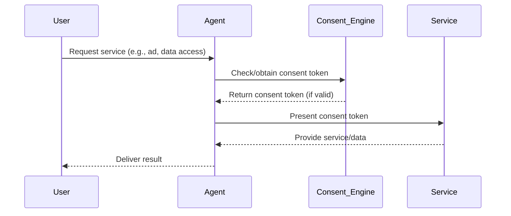

# Consent Grant Flow (SPP)

This diagram shows the protocol for granting and verifying user consent in the SPP ecosystem.

```mermaid
sequenceDiagram
    participant User
    participant Agent
    participant Consent_Engine
    participant Service
    User->>Agent: Request service (e.g., ad, data access)
    Agent->>Consent_Engine: Check/obtain consent token
    Consent_Engine-->>Agent: Return consent token (if valid)
    Agent->>Service: Present consent token
    Service-->>Agent: Provide service/data
    Agent-->>User: Deliver result
```

See also: [Consent Engine Spec](../specs/identity/consent-engine.md)
