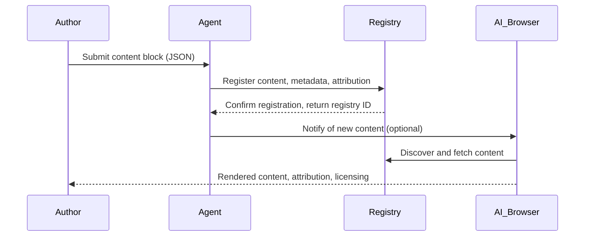

# Content Publishing Flow (SPP)

This diagram illustrates the end-to-end flow for publishing semantic content in the SPP ecosystem.

See also: [Semantic Blocks Spec](../specs/publishing/semantic-blocks.md), [Publishing Registry](../specs/spp/publishing-registry.md)
