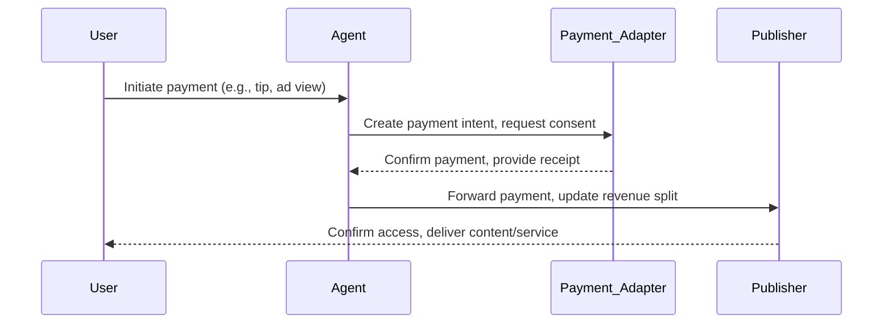

# Payment Flow (SPP)

This diagram outlines the micro-payment and revenue split process in the SPP protocol.

See also: [Micro-Payments Spec](../specs/payments/micro-payments.md), [Content Revenue Split](../specs/payments/content-revenue-split.md)
