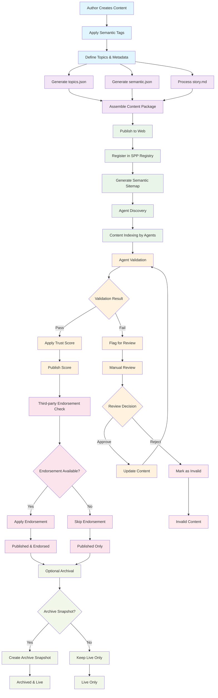
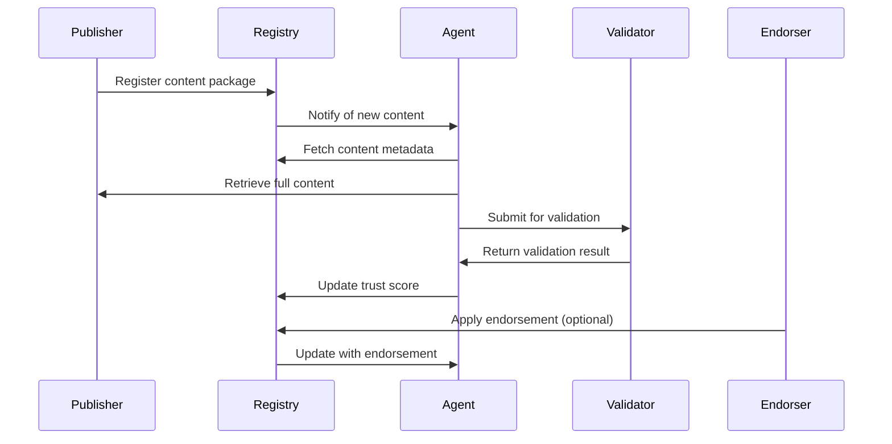

# Publishing Flow (SPP)

This diagram illustrates the complete end-to-end publishing lifecycle in the Semantic Publishing Protocol ecosystem, from content creation through archiving.

## Overview

The SPP publishing flow encompasses five key stages:
1. **Content Creation & Tagging** - Authors create content and apply semantic tags
2. **JSON Generation** - System generates semantic.json, topics.json, and processes story.md
3. **Publishing & Discovery** - Content is published to the web and discovered by agents
4. **Validation & Scoring** - Agents validate content and apply trust scores
5. **Endorsement & Archiving** - Third-party endorsements are applied and snapshots optionally archived

## Complete Publishing Lifecycle



## Detailed Flow Components

### 1. Content Creation & Tagging
- **Author Creates Content**: Writers, journalists, or content creators develop the base material
- **Apply Semantic Tags**: Content is tagged with relevant semantic identifiers for discoverability
- **Define Topics & Metadata**: Authors specify topic classifications and metadata requirements

### 2. JSON Generation Process
The system automatically generates three key files:

#### topics.json
```json
[
  {
    "id": "technology",
    "label": {
      "en": "Technology",
      "fr": "Technologie"
    },
    "global": "wikidata:Q739"
  }
]
```

#### semantic.json
```json
{
  "id": "content-unique-id",
  "title": "Content Title",
  "summary": "Brief summary of content",
  "topics": ["technology", "policy"],
  "tags": ["ai", "regulation"],
  "author": {
    "name": "Author Name",
    "id": "author:author-id"
  },
  "publisher": {
    "name": "Publisher Name",
    "id": "publisher:publisher-id"
  },
  "endorsements": [],
  "archived": false
}
```

#### story.md
The main content file containing the formatted story or article content.

### 3. Agent Interaction Flow



### 4. Validation & Trust Process
- **Agent Validation**: Automated agents check content for accuracy, completeness, and compliance
- **Trust Scoring**: Validated content receives trust scores based on agent assessments
- **Manual Review**: Failed validation triggers human review process
- **Score Publication**: Trust scores are published to the registry for agent consumption

### 5. Endorsement & Archival
- **Third-party Endorsement**: Independent validators can endorse content quality
- **Endorsement Application**: Verified endorsements are applied to content metadata
- **Archive Decision**: Publishers can choose to create permanent snapshots
- **Snapshot Creation**: Immutable archives preserve content state at publication time

## Integration Points

This publishing flow integrates with other SPP flows:
- **Consent Grant Flow**: For user permission management during content access
- **Payment Flow**: For monetization and licensing of published content
- **Content Publishing Flow**: This extends the basic content publishing sequence

## File Dependencies

- See: [Semantic JSON Spec](../specs/publishing/semantic-json.md)
- See: [Topics Spec](../specs/publishing/topics-spec.md)
- See: [Story Spec](../specs/publishing/story-spec.md)
- See: [Review Chain Protocol](../specs/publishing/review-chain.md)
- See: [SPP Validator Tool](../tools/spp-validator.md)

---

*This flow diagram supports implementer onboarding and clarifies the timing of validation and trust steps in the SPP ecosystem.*