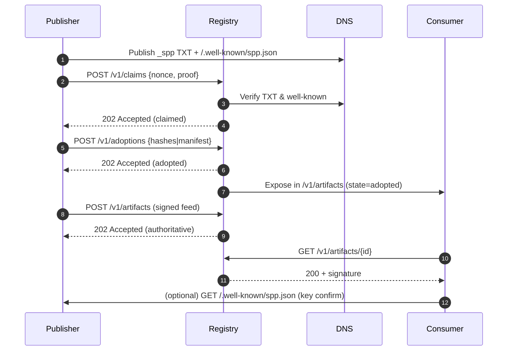

# Semantic Publishing Protocol Registry Architecture (v1)

**Version:** 1.0  
**Status:** Draft  
**Date:** 2025-01-11  
**Spec Code:** registry/architecture

---

## Purpose

The SPP Registry provides a DNS/HTTP-first discovery and verification infrastructure for the Semantic Publishing Protocol. It serves as a decentralized pointer system that enables AI browsers and agents to discover, index, and retrieve semantically structured content while maintaining publisher autonomy and user consent.

The registry architecture enables:
- **Discovery**: Location of published content via standardized endpoints
- **Verification**: Cryptographic validation of content authenticity and provenance  
- **Consent**: Enforcement of user and publisher consent policies
- **Interoperability**: Cross-registry federation and content syndication


---

## Scope & Deferrals

This section clarifies the explicit scope of SPP Registry Architecture v1 and features deferred to future versions:

**In Scope for v1:**
- **DNS/HTTP-first discovery infrastructure**
- **Core registry objects and schemas**
- **API surface for content registration, discovery, and consent enforcement**
- **Consent enforcement and revocation mechanisms**

**Explicitly Deferred to v2 and Later:**
- **Blockchain or peer-to-peer integration for registry**
- **NFT ownership and registry integration**
- **Advanced semantic search (beyond core metadata/topic/tag search)**
- **AI-native recommendation engines**
- **Decentralised consensus protocols for registry state**
- **Reputation scoring beyond basic trust signals**

---

---

## Roles and Responsibilities

### Publisher
A **Publisher** is an entity that creates and registers semantic content in the SPP ecosystem.

**Responsibilities:**
- **MUST** maintain a valid `.well-known/spp.json` endpoint
- **MUST** sign registry entries with their cryptographic identity using canonical JSON serialisation rules for signing (see [Canonicalisation and Signing](#canonicalisation-and-signing))
- **MUST** honor consent policies declared in registry metadata
- **SHOULD** provide timely updates when content changes or is removed

### Registry Operator
A **Registry Operator** hosts and maintains a registry instance that indexes content from multiple publishers.

**Responsibilities:**
- **MUST** implement the standard SPP Registry API (see API Surface section)
- **MUST** verify publisher signatures before accepting registry entries
- **MUST** respect consent and revocation requests
- **SHOULD** federate with other compliant registries
- **SHOULD** provide discovery interfaces for AI browsers and agents

### Consumer (AI Browser/Agent)
A **Consumer** queries registries to discover and access semantic content.

**Responsibilities:**
- **MUST** respect publisher consent policies
- **MUST** verify content signatures and provenance
- **SHOULD** cache registry data responsibly
- **SHOULD** honor publisher preferences for indexing and profiling

---

## Content Lifecycle

### 1. Registration (Reconstructed → Authoritative)

Publishers transition content from reconstructed (scraped/inferred) to authoritative (publisher-signed) state:

1. **Content Creation**: Publisher creates semantic content following SPP schemas
2. **Metadata Generation**: Publisher generates registry metadata with required fields
3. **Signing**: Publisher signs registry entry with their private key
4. **Discovery Endpoint**: Publisher exposes `.well-known/spp.json` with content pointers
5. **Registry Submission**: Publisher submits signed entry to chosen registry(ies)

### 2. Discovery

Consumers discover content through multiple pathways:

1. **Direct Discovery**: Query publisher's `.well-known/spp.json` endpoint
2. **Registry Query**: Search federated registries by topic, author, or metadata
3. **Sitemap Crawling**: Process publisher's `sitemap.json` for bulk discovery
4. **Federation**: Cross-registry content sharing and replication

### 3. Verification

All content MUST be verified before consumption:

1. **Signature Verification**: Validate publisher's cryptographic signature
2. **Schema Compliance**: Ensure content conforms to SPP schemas
3. **Consent Validation**: Check that access complies with declared policies
4. **Freshness Check**: Verify content has not been revoked or updated

### 4. Revocation

Publishers MAY revoke or update content at any time:

1. **Content Update**: Publisher updates content and re-signs registry entry
2. **Registry Notification**: Updated entry is submitted to all relevant registries
3. **Consumer Cache Invalidation**: Consumers **SHOULD** respect cache expiry headers
4. **Complete Revocation**: Publisher **MAY** remove content entirely from registries

---

## Core Objects

### Registry Entry

A **Registry Entry** represents a single piece of semantic content in the registry. It extends the base semantic content schema with registry-specific metadata. The core content **MUST** conform to `/schemas/semantic.json`, with additional registry fields:

**Base Semantic Content** (MVSL-compliant example):
```json
{
  "artifact": {
    "id": "urn:spp:example:article-123",
    "type": "article",
    "title": "string",
    "summary": "string",
      "language": "en",
      "spec_version": "0.4.0",
    "authors": [ { "name": "string", "url": "https://example.com/author" } ],
    "published_at": "2025-01-10T15:30:00Z",
    "updated_at": "2025-01-10T16:00:00Z",
    "topics": ["AI", "Policy"],
    "sections": ["Tech"],
    "media": [ { "role": "hero", "url": "https://example.com/img.jpg", "credit": "string", "license": "SPDX-ID" } ],
    "content": { "format": "markdown", "value": "..." },
    "links": [
      { "rel": "canonical", "href": "https://example.com/posts/123" }
    ],
    "provenance": {
      "mode": "reconstructed",
      "source_url": "https://example.com/posts/123",
      "captured_at": "2025-01-10T16:01:00Z",
      "capture_method": "rss",
      "reconstruction_confidence": 0.9,
      "content_hash": "sha256:<hex>",
      "snapshot_uri": "wacz://..."
    },
    "signatures": [
      { "signer": "did:key:z6Mk...", "sig": "base64url", "signedAt": "2025-01-10T16:00:00Z" }
    ],
    "version": 1
  }
}
```

> **Note:** The `provenance.content_hash` field **MUST** be in the form `sha256:<hex>` and **MUST** match the SHA-256 hash of the canonical JSON serialisation of the artifact (see [Canonicalisation and Signing](#canonicalisation-and-signing)).

**Field Requirements:**
- `id`: **MUST** be a globally unique identifier for the content.
- `title`: **MUST** be present and non-empty.
- `spec_version`: **MUST** match a version the registry currently supports (see [Spec Version Policy](#spec-version-policy)).
- `authors`: When provided, **MUST** be a non-empty array of author objects.
- `topics`: When provided, **MUST** contain an array of strings (topic tags).
- `language`: **MUST** be an ISO 639-1 language code; BCP 47 subtags MAY be used for locales.
- `links[rel=canonical].href`: **MUST** be an absolute **HTTPS** URL.
- `signatures[0]`: **MUST** contain an Ed25519 signature over canonical JSON, with `signer` resolvable to a valid DID/JWK.
- `provenance.content_hash`: **MUST** equal the SHA‑256 of the canonical JSON serialisation (see Canonicalisation and Signing).

### Spec Version Policy

- Registries **MUST** publish the set of supported `spec_version` values via `.well-known/spp/registry.json` (`specVersions.supported` / `specVersions.preferred`).
- During ingestion, artifacts whose `spec_version` exceeds the registry’s supported range **MUST** be rejected with HTTP `406 Not Acceptable` and a Problem Details payload explaining the unsupported revision.
- Registries **SHOULD** continue accepting artifacts for the previous supported MINOR release for at least one full publishing cycle, enabling producers to roll out upgrades gradually.
- Producers **SHOULD** maintain pipelines capable of emitting artifacts at any version in a partner registry’s supported set.

### Well-Known Endpoint

Publishers **MUST** expose a `.well-known/spp.json` endpoint containing registry metadata:

```json
{
  "protocolVersion": "1.0",
  "publisher": {
    "name": "Example Publisher",
    "id": "publisher:example",
    "did": "did:key:z6MkABC...",
    "uri": "https://example.com",
    "publicKeyJwk": {"kty":"OKP","crv":"Ed25519","x":"Kf-1Q...base64url..."},
    "trustModel": "editorial-chain"
  },
  "endpoints": {
    "sitemap": "https://example.com/spp/sitemap.json",
    "content": "https://example.com/spp/content/",
    "registry": "https://example.com/spp/registry/",
    "harvest": "https://registry.example.net/v1/harvest",
    "transparency_log": "https://registry.example.net/ct"
  },
  "policies": {
    "consent": "https://example.com/spp/consent-policy.json",
    "privacy": "https://example.com/privacy",
    "terms": "https://example.com/terms"
  },
  "federation": {
    "allowCrawling": true,
    "allowIndexing": true,
    "cacheMaxAge": 3600
  }
}
```

**Requirements:**
- The `publicKeyJwk` field **MUST** be an Ed25519 public key in JWK (JSON Web Key) format.
- Publishers **MUST** support a key rotation policy, allowing for secure rollover and timely replacement of signing keys. Registries and consumers **MUST** recognize and honor rotated keys based on authenticated updates to the `.well-known/spp.json` endpoint.

### Sitemap

Publishers **SHOULD** expose a machine-readable sitemap at the declared endpoint:

```json
{
  "version": "1",
  "lastModified": "2025-01-11T10:00:00Z",
  "page": 1,
  "next": "https://example.com/spp/sitemap.json?page=2",
  "content": [
    {
      "type": "article",
      "url": "https://example.com/spp/content/article-123.json",
      "lastModified": "2025-01-10T15:30:00Z",
      "digest": "sha256:abc123..."
    }
  ]
}
```

Sitemaps **MUST** include a `version` field (initially "1"). Large publishers **SHOULD** paginate using `page`/`next` and **MUST** ensure stable ordering by `lastModified` descending. Each item’s `digest` **MUST** match the artifact’s `provenance.content_hash`.

---

## Storage Recommendations

### Publisher Storage

Publishers **SHOULD** organize content using the following structure:

```
/.well-known/spp.json          # Registry metadata
/spp/sitemap.json              # Content index
/spp/content/<id>.json         # Individual content files
/spp/policies/                 # Consent and privacy policies
/spp/keys/                     # Public key materials
```

**Best Practices:**
- Use content-addressed storage for immutability (e.g., IPFS hashes as filenames)
- Implement proper HTTP caching headers (Cache-Control, ETag)
- Serve content over HTTPS with valid certificates
- Provide both human-readable and machine-readable formats

### Registry Storage

Registry operators **SHOULD** use persistent storage systems that support:

- **High Availability**: Multi-region replication for fault tolerance
- **Consistency**: Strong consistency for signature verification
- **Scalability**: Horizontal scaling for large content volumes
- **Backup**: Regular backups with point-in-time recovery

**Recommended Architecture:**
- Primary database: PostgreSQL with JSON columns for metadata
- Search index: Elasticsearch for topic and tag queries  
- Cache layer: Redis for frequently accessed content
- Object storage: S3-compatible storage for large content files

---

## API Surface Summary

The SPP Registry API is HTTP/JSON. The full contract is defined in `/openapi/registry.yml`.

### Core Endpoints (Registry)
- `GET /v1/artifacts` — Search/browse artifacts
- `GET /v1/artifacts/{id}` — Retrieve by ID
- `POST /v1/artifacts` — Ingest artifact (signed)
- `POST /v1/claims` — Submit namespace claim proof
- `POST /v1/adoptions` — Adopt artifacts by hash/manifest
- `GET /v1/harvest/ListIdentifiers` — Harvest identifiers (cursored)
- `GET /v1/harvest/ListRecords` — Harvest records (cursored)
- `GET /v1/harvest/GetRecord` — Fetch a single record
- `GET /ct/sth` — Latest Signed Tree Head
- `GET /ct/proof?id=sha256:...` — Inclusion proof
- `GET /v1/ownership` — Ownership lookup (optional)
- `POST /v1/ownership` — Submit ownership object (optional)

### Publisher Endpoints
- `GET /.well-known/spp.json` — Publisher metadata & keys
- `GET /spp/sitemap.json` — Content index
- `GET /spp/content/{id}.json` — Artifact payloads

### Authentication
Mutating endpoints **MUST** be authenticated via detached request signatures bound to the publisher DID/JWK. Scopes **MUST** constrain publishers to their namespaces.

---

## Security Model

### Trust Architecture

The SPP Registry uses a **web-of-trust** model combined with **cryptographic verification**:

1. **Publisher Identity**: Publishers **MUST** maintain cryptographic identities
2. **Content Signing**: All registry entries **MUST** be cryptographically signed
3. **Verification Chain**: Consumers **MUST** verify signatures before trusting content
4. **Reputation System**: Registries **MAY** implement reputation scoring for publishers (limited to basic trust signals in v1)

Registries **MAY NOT** modify publisher content and **MAY ONLY** relay signed entries. Any modification invalidates the publisher's signature and **MUST** be rejected by consumers.

### Canonicalisation and Signing

All publisher signatures **MUST** use Ed25519 keys (as specified in the JWK format in `.well-known/spp.json`). The content to be signed **MUST** be serialised using a canonical JSON process, specifically following [RFC 8785 (JSON Canonicalization Scheme)](https://datatracker.ietf.org/doc/html/rfc8785) (e.g., lexicographically sorted keys, no insignificant whitespace, UTF-8 encoding). The `digest` field **MUST** be the SHA-256 hash of this canonical JSON. To prevent replay attacks, every signed registry entry **MUST** include a `signedAt` timestamp (RFC 3339 format), and consumers/registries **MUST** reject signatures older than 7 days. Publishers **MUST** rotate keys securely and update the `.well-known/spp.json` endpoint accordingly.

### Threat Model

The security model addresses the following threats:

#### Content Tampering
**Threat**: Malicious modification of content after publication  
**Mitigation**: Cryptographic signatures and content hashes **MUST** be verified

#### Identity Spoofing  
**Threat**: Attackers impersonating legitimate publishers  
**Mitigation**: Strong cryptographic identity requirements and key verification

#### Registry Compromise
**Threat**: Malicious registry operators serving false content  
**Mitigation**: Content verification happens at consumer level, not registry level

#### Denial of Service
**Threat**: Resource exhaustion attacks against registries  
**Mitigation**: Rate limiting, authentication requirements for writes

#### Key Compromise
**Threat**: Publisher signing key is compromised
**Mitigation**: Immediate revocation of compromised key via an authenticated update to `.well-known/spp.json`, and mandatory re-signing of all active registry entries using the new key.

### Privacy Protections

#### Data Minimization
Registries **MUST** store only the minimum metadata required for discovery:
- No personal information beyond declared publisher identity
- No tracking of consumer queries or access patterns
- Optional pseudonymization of publisher identities

#### Consent Enforcement
Registries **MUST** honor publisher consent declarations:
- `allowIndexing: false` content **MUST NOT** be indexed for search
- `allowProfiling: false` content **MUST NOT** be used for behavioral analysis
- `dataRetention` limits **MUST** be enforced with automatic deletion

#### Right to Deletion
Publishers **MUST** be able to request complete removal of their content:
- Registry entries **MUST** be deleted upon authenticated request
- Cached content **SHOULD** be invalidated across federated registries
- Consumers **SHOULD** respect deletion notices
- Registries **SHOULD** issue a signed deletion receipt containing the artifact ID, timestamp, and request verifier.
## Provenance States (Normative)

SPP defines four provenance states for artifacts:

- **reconstructed** — third‑party reconstruction without a publisher signature.
- **claimed** — publisher control of the namespace verified (DNS/.well‑known), but artifact not yet signed.
- **adopted** — publisher has acknowledged the artifact (by content hash or manifest); awaiting or substituting a signed feed.
- **authoritative** — artifact and future updates are publisher‑signed; registries relay without modification.

State transitions **MUST** follow: reconstructed → claimed → adopted → authoritative. Direct jumps that skip required proofs **MUST NOT** occur.


## HTTP Behaviour (Normative)

### Media types and negotiation
Implementations **MUST** serve artifacts with `Content-Type: application/spp+json;v=1`. Signed Tree Heads **MUST** be served with `Content-Type: application/spp.sth+json;v=1`. Clients **MUST** use HTTP content negotiation (`Accept`) and servers **SHOULD** support `gzip` or `br` compression. Servers **SHOULD** emit `ETag` and `Last-Modified` for cacheable GETs and **MUST** respond to `If-None-Match` / `If-Modified-Since` with `304 Not Modified` when applicable.

### Pagination and cursors
All list endpoints **MUST** support `limit` and `cursor` query parameters. `limit` **MUST** default to `50` and **MUST NOT** exceed `100`. The response **MUST** include a `Link` header with `rel="next"` when another page is available. Cursors **MUST** be opaque **base64url**-encoded JSON objects containing at minimum:
```json
{"v":1,"t":"2025-01-01T00:00:00Z","o":"<server-defined-offset>"}
```
Servers **MUST** treat cursors as immutable tokens and **MUST** refuse malformed or expired cursors with `400`.

### Rate limits
Servers **SHOULD** publish standardized rate-limit headers: `RateLimit-Limit`, `RateLimit-Remaining`, `RateLimit-Reset`. Exceeding limits **MUST** return `429 Too Many Requests` with a Problem Details body.

---

## Error Model (Normative)

All error responses **MUST** use Problem Details [RFC 7807] with `Content-Type: application/problem+json`. Reserved `type` values include:

- `about:blank`
- `https://spp.dev/problems/invalid-request`
- `https://spp.dev/problems/unauthorized`
- `https://spp.dev/problems/forbidden`
- `https://spp.dev/problems/not-found`
- `https://spp.dev/problems/conflict`
- `https://spp.dev/problems/rate-limited`
- `https://spp.dev/problems/unprocessable-entity`
- `https://spp.dev/problems/server-error`

Example:
```json
{
  "type": "https://spp.dev/problems/unprocessable-entity",
  "title": "Schema validation failed",
  "status": 422,
  "detail": "Field provenance.content_hash is missing",
  "instance": "/v1/artifacts",
  "errors": [{"path":"/artifact/provenance/content_hash","message":"required"}]
}
```

---

## DNS TXT Record Grammar (Normative)

The `_spp` TXT record **MUST** follow this ABNF (RFC 5234 / RFC 4648):

```
spp-txt    =  *(ws / pair / sep)
pair       = key "=" value
key        = "did" / "pk" / "scopes" / "policy" / extkey
extkey     = 1*( ALPHA / DIGIT / "-" / "_" )
value      = didval / pkval / scopesval / polval / extval
didval     = "did:" 1*( ALPHA / DIGIT / ":" / "-" / "_" )
pkval      = "ed25519:" 1*( ALPHA / DIGIT / "-" / "_" )   ; base64url
scopesval  = 1*scope *( "," scope )
scope      = "/" *( VCHAR )
polval     = 1*( VCHAR )
extval     = 1*( VCHAR )
sep        = *ws ";" *ws
ws         = WSP
```

**Examples (BIND style):**
```
_spp.example.com. 3600 IN TXT "did=did:key:z6MkABC...; pk=ed25519:Kf-1Q...; scopes=/,/news/*; policy=auto-adopt"
_spp._tcp.example.com. 3600 IN SRV 0 0 443 registry.example.net.
example.com. 3600 IN HTTPS 1 registry.example.net. alpn="h2,h3"
```

Operators **SHOULD** keep TXT answers ≤512 octets for UDP compatibility (use split strings as needed; RFC 7208).

---

## Appendix A — Normative Algorithms (Normative)

### A.1 Canonical JSON Serialisation
To produce canonical JSON for signing and hashing, implementations **MUST** follow [RFC 8785] and additionally:
1. Normalise all strings to Unicode NFC.
2. Remove fields outside the schema unless under an `extensions` object; if present, canonicalise recursively.
3. Sort object members lexicographically; no insignificant whitespace; newline `\n` only.

### A.2 Artifact Content Hash
```
sha256 = SHA-256( canonical_json_bytes )
digest = "sha256:" + hex(SHA-256)
```
Set `provenance.content_hash = digest`.

### A.3 Signature Verification (Ed25519)
1. Resolve `signature.signer` DID → JWK (Ed25519, not revoked/expired).
2. Base64url‑decode `signature.sig`.
3. Verify `ed25519_verify(public_key, canonical_json_bytes, sig)`.
4. Ensure `signedAt` is within 7 days (UTC) of verification time.

### A.4 Transparency Log — Inclusion Proof Verification
Given leaf hash `H_leaf`, root hash `H_root`, and audit path `[n0..nk]`, compute by concatenating in left/right order using SHA‑256 and assert equality with `H_root`.

---

## Appendix B — Conformance Requirements Matrix (Normative)

- **REG‑SIG‑001** — Ed25519 signatures over canonical JSON (A.1) are **MUST**.
- **REG‑SIG‑002** — `provenance.content_hash` equals SHA‑256 of canonical JSON (A.2) **MUST**.
- **REG‑HTTP‑001** — Support `application/spp+json;v=1` and Problem Details **MUST**.
- **REG‑HTTP‑002** — Cursor pagination with `Link: rel="next"` on list endpoints **MUST**.
- **REG‑DNS‑001** — `_spp` TXT conforms to grammar **MUST**.
- **REG‑LOG‑001** — `/ct/sth` and `/ct/proof` implement inclusion proof verification **MUST**.
- **REG‑PERF‑001** — Search (≤100 items) P95 ≤500 ms **MUST**.
- **REG‑CONSENT‑001** — Authenticated revocations processed ≤24 h with deletion receipt **MUST**.


#### Transparency Logs
Registries **SHOULD** provide transparency logs of consent and deletion requests. These logs **SHOULD** be cryptographically signed and made publicly auditable to ensure accountability and traceability of consent and deletion actions.

---

## Cross-Registry Federation

### Federation Protocol

Registries **MAY** federate with other SPP-compliant registries using the following mechanisms:

#### Content Syndication
- Registries **MAY** replicate entries from trusted partner registries
- Replicated content **MUST** maintain original signatures and provenance
- Attribution to source registry **MUST** be preserved

#### Query Federation  
- Search queries **MAY** be forwarded to federated registries
- Results **MUST** be aggregated and de-duplicated
- Query performance **SHOULD** be optimized through caching

#### Trust Propagation
- Registry reputation **MAY** be shared across federation networks
- Trust scores **MUST** be clearly attributed to calculating registry
- Consumers **SHOULD** validate trust calculations independently

#### Conflict Resolution
- When the same content is available from both the direct publisher source and a registry copy, consumers and registries **MUST** prefer the direct publisher source.
- If conflicting signatures are found for the same content identifier, any entry that cannot be verified against the publisher's declared public key **MUST** be discarded as unverified.

### Federation Requirements

To participate in federation, registries **MUST**:

1. **Implement Standard API**: Full compatibility with SPP Registry API specification
2. **Verify Signatures**: Independent cryptographic verification of all content  
3. **Honor Consent**: Respect publisher consent policies across federation
4. **Provide Provenance**: Clear attribution of content sources and trust signals
5. Federation partners **MUST** sign an inter-registry agreement specifying trust rules and consent propagation policies.

---

## Compliance Requirements

### MUST Requirements

Implementations **MUST** satisfy the following requirements for SPP v1 compliance:

- **Schema Conformance**: All data **MUST** conform to schemas in `/schemas/`
- **Signature Verification**: All content **MUST** be cryptographically verified
- **Consent Enforcement**: Publisher consent policies **MUST** be honored
- **Standard Endpoints**: `.well-known/spp.json` endpoint **MUST** be available
- **Error Handling**: HTTP error codes **MUST** follow REST conventions

### SHOULD Requirements  

Implementations **SHOULD** include the following features for optimal interoperability:

- **Federation Support**: Cross-registry content sharing and discovery
- **Caching Headers**: Proper HTTP caching for performance optimization
- **Rate Limiting**: Protection against abuse and resource exhaustion
- **Monitoring**: Logging and metrics for operational visibility
- **Documentation**: Clear API documentation and integration guides

### MAY Requirements

Implementations **MAY** include additional features:

- **Advanced Search**: Full-text search, semantic similarity, recommendation engines
- **Analytics Dashboard**: Publisher analytics and content performance metrics  
- **Content Moderation**: Automated filtering for policy compliance
- **Multi-format Support**: Alternative content formats beyond JSON

### Performance

Registries **MUST** respond to search queries returning up to 100 items in under 500ms under normal load. Registries **MUST** maintain at least 99.9% uptime. Registries **MUST** support disaster recovery procedures that do not break signature trust or provenance guarantees.

Registries **MUST** be load tested to handle at least 100 concurrent requests without exceeding 1 second latency per request.

---
## Implementation Notes & Testability

### Reference Implementation Guidance
- Reference implementations **SHOULD** be language-agnostic and may be developed in any modern programming language.
- All implementations **MUST** support schema validation against the SPP schemas in `/schemas/`.
- Implementations **MUST** support cryptographic signature verification for all registry entries and publisher metadata.

### Interoperability Testing
- Registries and consumers **SHOULD** be validated using the conformance test suites provided in the `/conformance/` directory.
- Mock publisher data and example registry entries are available in `/conformance/fixtures/` for integration testing.

### Example API Queries and Expected Responses

#### Publisher Endpoints
- `GET /.well-known/spp.json`  
  **Example Query:**  
  `curl https://example.com/.well-known/spp.json`  
  **Expected Response:**  
  200 OK, JSON body as shown in the [Well-Known Endpoint](#well-known-endpoint) section.

- `GET /spp/sitemap.json`  
  **Example Query:**  
  `curl https://example.com/spp/sitemap.json`  
  **Expected Response:**  
  200 OK, JSON body as shown in the [Sitemap](#sitemap) section.

- `GET /spp/content/{id}`  
  **Example Query:**  
  `curl https://example.com/spp/content/article-123.json`  
  **Expected Response:**  
  200 OK, JSON body conforming to `/schemas/semantic.json` and registry extensions.

#### Registry Endpoints
- `POST /api/v1/entries`  
  **Example Query:**  
  `curl -X POST https://registry.example.com/api/v1/entries -d @entry.json -H 'Content-Type: application/json'`  
  **Expected Response:**  
  201 Created, JSON body with registered entry and assigned ID.

- `GET /api/v1/entries/{id}`  
  **Example Query:**  
  `curl https://registry.example.com/api/v1/entries/article-123`  
  **Expected Response:**  
  200 OK, JSON body matching the registered entry.

- `GET /api/v1/search?topic=ai`  
  **Example Query:**  
  `curl 'https://registry.example.com/api/v1/search?topic=ai'`  
  **Expected Response:**  
  200 OK, JSON array of matching entries (up to 100).

- `DELETE /api/v1/entries/{id}`  
  **Example Query:**  
  `curl -X DELETE https://registry.example.com/api/v1/entries/article-123 -H 'Authorization: ...'`  
  **Expected Response:**  
  204 No Content if deletion successful.

#### Discovery Endpoints
- `GET /api/v1/publishers`  
  **Example Query:**  
  `curl https://registry.example.com/api/v1/publishers`  
  **Expected Response:**  
  200 OK, JSON array of publisher objects.

- `GET /api/v1/topics`  
  **Example Query:**  
  `curl https://registry.example.com/api/v1/topics`  
  **Expected Response:**  
  200 OK, JSON array of topic objects.

- `GET /api/v1/recent`  
  **Example Query:**  
  `curl https://registry.example.com/api/v1/recent`  
  **Expected Response:**  
  200 OK, JSON array of recently published entries.

## Change Management

- The SPP Registry specification follows [semantic versioning](https://semver.org/) with a `MAJOR.MINOR.PATCH` scheme.
- Deprecation notices for endpoints, objects, or fields **MUST** be communicated via the publisher's `.well-known/spp.json` endpoint.
- Registries **MUST** support the previous `MINOR` version of the protocol for at least 6 months after a `MAJOR` version release, ensuring backward compatibility and a smooth migration path.


## Related Specifications

This architecture specification should be read in conjunction with:

- **[SPP Registry and Discovery](../spp/registry-and-discovery.md)**: Discovery mechanisms and protocols
- **[SPP Publishing Registry](../spp/publishing-registry.md)**: Registry entry formats and submission process  
- **[SPP Core](../SPP-Core.md)**: Core entities and data structures
- **[SPP Protocols](../SPP-Protocols.md)**: Protocol stack and layering

Additional resources:

- **OpenAPI Specification**: To be provided in future versions
- **Schema Definitions**: `/schemas/` directory for all data formats
  - `/schemas/topic.json` **MUST** reference a master topic taxonomy repository.
- **Conformance Tests**: `/conformance/` directory for validation tools

---

## Version History

- **v1.0** (2025-01-11): Initial architecture specification
  - DNS/HTTP-first implementation
  - Core object definitions aligned with schemas
  - Security model and federation protocols
  - Compliance requirements for v1

---

*This specification uses RFC 2119 key words. "**MUST**", "**MUST NOT**", "**REQUIRED**", "**SHALL**", "**SHALL NOT**", "**SHOULD**", "**SHOULD NOT**", "**RECOMMENDED**", "**MAY**", and "**OPTIONAL**" have specific meanings as defined in RFC 2119.*

---

## Appendix C — Test Vectors (Normative)

This appendix provides concrete, reproducible vectors to validate canonicalisation and hashing across implementations.

### C.1 Artifact → Canonical JSON → SHA‑256

**Input (artifact JSON):**
```json
{
  "artifact": {
    "id": "urn:spp:example:tv-001",
    "type": "article",
    "title": "Test Vector One",
    "summary": "Minimal MVSL artifact",
    "language": "en",
    "authors": [ { "name": "Example Author", "url": "https://example.com/author" } ],
    "published_at": "2025-01-10T15:30:00Z",
    "updated_at": "2025-01-10T16:00:00Z",
    "topics": ["Testing"],
    "sections": [],
    "media": [],
    "content": { "format": "markdown", "value": "Hello **world**" },
    "links": [ { "rel": "canonical", "href": "https://example.com/posts/tv-001" } ],
    "provenance": {
      "mode": "reconstructed",
      "source_url": "https://example.com/posts/tv-001",
      "captured_at": "2025-01-10T16:01:00Z",
      "capture_method": "rss",
      "reconstruction_confidence": 0.8
    },
    "version": 1
  }
}
```

**Canonical JSON (RFC 8785 + rules in Appendix A.1):**
```
{"artifact":{"authors":[{"name":"Example Author","url":"https://example.com/author"}],"content":{"format":"markdown","value":"Hello **world**"},"id":"urn:spp:example:tv-001","language":"en","links":[{"href":"https://example.com/posts/tv-001","rel":"canonical"}],"media":[],"published_at":"2025-01-10T15:30:00Z","sections":[],"summary":"Minimal MVSL artifact","topics":["Testing"],"provenance":{"capture_method":"rss","captured_at":"2025-01-10T16:01:00Z","mode":"reconstructed","reconstruction_confidence":0.8,"source_url":"https://example.com/posts/tv-001"},"title":"Test Vector One","type":"article","updated_at":"2025-01-10T16:00:00Z","version":1}}
```

**SHA‑256 of canonical bytes (hex):**
```
083c601fda9769b827547824618b000e9f42090f49aa0ebeed03d500bc527e2b
```

**Expected `provenance.content_hash`:**
```
sha256:083c601fda9769b827547824618b000e9f42090f49aa0ebeed03d500bc527e2b
```

> Note: Signatures are not included in this vector to keep the canonical form deterministic without key material. Implementations **MUST** be able to reproduce the canonical string and the hash exactly.

### C.2 Inclusion Proof (structure only)

Given the leaf hash `H_leaf = SHA-256("SPP-LOG-LEAF\0" || canonical_entry_bytes)` and a tree root `H_root`, a valid audit path MUST, when verified via Appendix A.4, reproduce `H_root`. Provide your implementation’s path and verify against the registry’s `/ct/proof` response.

---

## Appendix D — Sequence Diagrams (Informative)

### D.1 Claim & Adopt Flow


### D.2 Transparency Log Proof Verification
```mermaid
sequenceDiagram
  participant Con as Consumer
  participant Reg as Registry

  Con->>Reg: GET /ct/sth
  Reg-->>Con: STH {root_hash, tree_size, created_at}
  Con->>Reg: GET /ct/proof?id=sha256:...
  Reg-->>Con: {audit_path: [n0..nk]}
  Con->>Con: Compute leaf hash; fold audit path; compare to root
  Con-->>Con: Accept if equal; else reject
```

### D.3 Deletion Propagation Across Federation
```mermaid
sequenceDiagram
  participant Pub as Publisher
  participant RegA as Registry A
  participant RegB as Registry B

  Pub->>RegA: Authenticated deletion request
  RegA-->>Pub: Signed deletion receipt
  RegA->>RegB: WebSub/event: deletion notice with proof
  RegB-->>RegA: 202 Accepted
  RegB->>RegB: Remove artifact; append to deletion log
```

---

## API Contract Snapshot (Informative)

The authoritative API contract lives in `/openapi/registry.yml`. This snapshot aligns endpoints, media types, and error models with this spec.

```yaml
openapi: 3.1.0
info:
  title: SPP Registry API
  version: 1.0.0-draft
servers:
  - url: https://{host}
    variables:
      host:
        default: registry.example.net
components:
  securitySchemes:
    didSig:
      type: http
      scheme: bearer
      description: Detached DID-bound request signatures (implementation-specific)
  responses:
    Problem:
      description: Problem Details
      content:
        application/problem+json:
          schema:
            type: object
            properties:
              type: { type: string, format: uri }
              title: { type: string }
              status: { type: integer }
              detail: { type: string }
              instance: { type: string }
paths:
  /v1/artifacts:
    get:
      summary: Search artifacts
      parameters:
        - in: query
          name: q
          schema: { type: string }
        - in: query
          name: cursor
          schema: { type: string, description: base64url cursor }
        - in: query
          name: limit
          schema: { type: integer, maximum: 100, default: 50 }
      responses:
        '200':
          description: OK
          headers:
            Link: { description: pagination link rel=next, schema: { type: string } }
          content:
            application/spp+json;v=1:
              schema: { type: object }
        '429': { $ref: '#/components/responses/Problem' }
    post:
      summary: Ingest artifact
      requestBody:
        required: true
        content:
          application/spp+json;v=1:
            schema: { $ref: '../schemas/semantic.json' }
      responses:
        '202': { description: Accepted }
        '422': { $ref: '#/components/responses/Problem' }
  /v1/artifacts/{id}:
    get:
      summary: Get artifact by ID
      parameters:
        - in: path
          name: id
          required: true
          schema: { type: string }
      responses:
        '200':
          description: OK
          content:
            application/spp+json;v=1:
              schema: { $ref: '../schemas/semantic.json' }
        '404': { $ref: '#/components/responses/Problem' }
  /ct/sth:
    get:
      summary: Latest Signed Tree Head
      responses:
        '200':
          description: OK
          content:
            application/spp.sth+json;v=1:
              schema: { $ref: '../schemas/transparency-sth.json' }
  /ct/proof:
    get:
      summary: Inclusion proof
      parameters:
        - in: query
          name: id
          required: true
          schema: { type: string, description: artifact content_hash }
      responses:
        '200':
          description: OK
          content:
            application/spp+json;v=1:
              schema: { type: object }
```

---

## HTTP Behaviour — Addenda (Normative)

### Idempotency
- `POST /v1/claims` **MUST** be idempotent with respect to the same `nonce`; duplicate submissions **MUST** return the original result (200/202) without side effects.
- `POST /v1/adoptions` **SHOULD** be idempotent for identical manifests/hashes.

### Payload Limits
- Servers **MUST** reject payloads exceeding **512 KiB** for artifact JSON with `413 Payload Too Large` and a Problem Details body.
- Arrays **SHOULD** be bounded: `authors` ≤ 32, `media` ≤ 64, `topics` ≤ 128.
