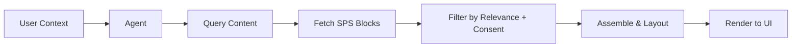

# AI Browser Specification
**Version:** 0.1  
**Status:** Final  
**Date:** 2025-07-28  
**Spec Code:** spp/ai-browser-spec

---

## 🌐 Purpose

This specification defines how **AI-powered browsers** function as primary interfaces for consuming the Semantic Publishing Web.

These browsers are not passive rendering engines — they are **intelligent context engines** that:

- Pull in modular SPS blocks
- Render content dynamically
- Respect user consent and focus
- Integrate agents, ads, and personalisation
- Avoid surveillance by default

---

## 🧠 Core Responsibilities

1. **Interpret User Context**
   - Focus mode
   - Device (desktop, glasses, car, etc.)
   - Location, time, ambient inputs
   - Active agent goals

2. **Fetch & Filter SPS Content**
   - From registries, `.well-known`, feeds, or subscriptions
   - Filtered by trust, interest, freshness, and consent

3. **Render Dynamically**
   - Assemble modular blocks into cohesive user experiences
   - Use real-time layout heuristics
   - Support pluggable UI engines (e.g. web, MR, voice, AR)

4. **Protect User Identity**
   - Local profile and preferences
   - Zero third-party trackers
   - Full consent logs and override ability

---

## 📦 Rendering Pipeline

The browser works as an **experience assembler** — driven by agent recommendations and user state.

---

## 🔒 Privacy by Default

| Feature              | AI Browser Behaviour               |
|----------------------|------------------------------------|
| Cookies              | Disabled by default                |
| IP Tracking          | Masked or local proxy              |
| Analytics            | Local-only, opt-in to share        |
| Consent              | Required before outbound call      |
| Focus Mode           | Suppresses non-essential content   |

---

## 📎 Plugin System

The browser supports **modular plugins** for:
- Custom UI renderers (e.g. VR, voice)
- Agent backends
- Context enrichment (e.g. health data, environment)
- Language packs / localisation
- Consent mediators

---

## 🎯 User Controls

Users control:
- Visual layout (cards, narrative, grid)
- Data sharing (granular toggles)
- Agent mode (curated, conversational, passive)
- Ad preferences (topics, tone, frequency)

No server-side profiles are created unless explicitly opted in.

---

## 🔁 Supported Actions

| Action          | Description                                      |
|------------------|--------------------------------------------------|
| `browse()`       | Retrieve and explore SPS content                 |
| `search()`       | Keyword or intent-driven discovery               |
| `explain()`      | Ask agent to clarify or narrate content          |
| `hide()`         | Remove irrelevant blocks                         |
| `follow()`       | Subscribe to content/persona/entity              |
| `share()`        | Forward to contact or cross-device               |

---

## 📡 Sync & Continuity

AI browsers may:
- Sync via user-controlled encrypted cloud
- Follow context from phone → tablet → glasses
- Store preferences locally and portably (`ssot_profile.json`)

---

## 🔮 Future Possibilities

- Live translation
- Dynamic mood-based content
- Emotionally adaptive layout
- AI summarised “view” mode
- Real-time knowledge map visualisation

---

## 🤝 Summary

AI Browsers are **the new interface layer** of the web.  
Not static HTML renderers.  
But real-time interpreters of user intent, identity, and trust.

This spec defines how they interact with agents, content, and the Semantic Publishing Protocol.

